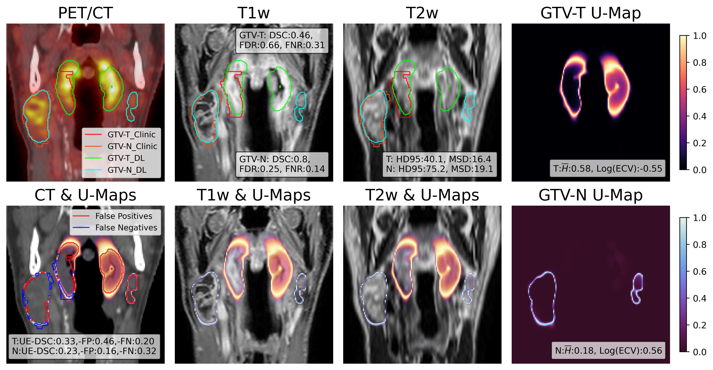

# Uncertainty estimation for Head and Neck tumour Segmentation with nnUNet
This repository contains code and visualizations for comparing various uncertainty estimation methods applied to the auto-segmentation of head and neck tumors, focusing on both Gross Tumor Volume primary (GTV-T) and Nodes (GTV-N).

This repository could also work for other cancer sites or tasks, just remember to change the target value of 1 (GTV-T) and 2 (GTV-N) to your own label numbers. 


##### Example figure of the use of uncertainty map (U-Map) for error detection (Complex of MC dropout, Ensemble, Snapshot checkpoints applied).


## Setting Up Your Environment
This study primarily builds upon the original nnUNet framework (version 1), with several modifications to facilitate uncertainty estimation. To replicate our environment and ensure compatibility, please follow the steps below to create and install the necessary components in a new virtual environment.

### Prerequisites
Ensure you have Anaconda or Miniconda installed on your system to manage virtual environments and dependencies.

### Installation Steps
```
conda create -n probseg
conda activate probseg
cd nnUNet_uncertainty
pip install -e .
```
### Training example commands:
#### 1. Mont Carlo Drop out with dropout rate of 0.2:
   In `nnUNet_uncertainty/nnunet/training/network_training/nnUNetTrainerV2_dropout.py` file:
   ```
   dropout_op_kwargs = {'p': 0.2, 'inplace': True} # set p to 0.2
   ```
   Then run the training command:
   ```
    nnUNet_train 3d_fullres nnUNetTrainerV2_dropout $Your_Task$ $fold$ --npz
   ```
   - Replace $Your_Task$ to your task name/id
   - Replace $fold$ to your training fold or all to not split the training set.
     
#### 2. Snapshot:
   In `nnUNet_uncertainty/nnunet/training/network_training/nnUNetTrainerV2_dropout_snap.py` file, set snapshot parameters:
   ```
        self.save_snapshots = True # if save snapshot checkpoints or not?
        self.max_num_epochs = 1500 # maximum training epochs.
        self.restart_lr_after = 1000 # restart learning rate every 100 epochs after certain epochs of training (here is 1000). 
        self.restart_multiplications = 1.5 # by how much should the learning rate be increased for each restart
   ```
   Then run the training command:
   ```
    nnUNet_train 3d_fullres nnUNetTrainerV2_dropout_snap $Your_Task$ $fold$ --npz
   ```
#### 3. Complex:
To enable dropout in the snapshot trainer, set the `p` value from 0 to 0.2 in the nnUNet_uncertainty/nnunet/training/network_training/nnUNetTrainerV2_dropout_snap.py file.   
```
   dropout_op_kwargs = {'p': 0.2, 'inplace': True} # set p to 0.2
```
Also set parameters similar to Snapshot.

Since we also need to enable ensemble training, run the following command for each fold of your training:

   ```
    nnUNet_train 3d_fullres nnUNetTrainerV2_dropout_snap $Your_Task$ 0 --npz
    nnUNet_train 3d_fullres nnUNetTrainerV2_dropout_snap $Your_Task$ 1 --npz
    nnUNet_train 3d_fullres nnUNetTrainerV2_dropout_snap $Your_Task$ 2 --npz
    nnUNet_train 3d_fullres nnUNetTrainerV2_dropout_snap $Your_Task$ 3 --npz
    nnUNet_train 3d_fullres nnUNetTrainerV2_dropout_snap $Your_Task$ 4 --npz

   ```
#### 4. Phiseg
   Training command:
   ```
    nnUNet_train 3d_fullres nnUNetTrainerV2_PhiSeg $Your_Task$ $fold$ --npz
   ```
   
### Inference with uncertainty estimation methods
The inference codes were customized from the original nnUNet to enable sampling from the distributions created during the training phase. Follow the instructions below to obtain the probability maps or uncertainty maps.
#### 1. Ensemble - Similar to the original nnUNet, predictions are made from 5 folds. The difference here is an additional augmentation operation that utilizes Gaussian noise (sigma=0.1).
   ```
   nnUNet_predict -i $input_image_folder$ -o $output_folder$ -tr nnUNetTrainerV2  -t $task_name$ -m 3d_fullres -f 0 1 2 3 4 --npz 
   ```
Folds 0, 1, 2, 3, and 4 are the corresponding folds you want to ensemble from.

#### 2. Monte Carlo Dropout
   ```
   nnUNet_predict -i $input_image_folder$ -o $output_folder$ -tr nnUNetTrainerV2_dropout  -t $task_name$ -m 3d_fullres -f all --npz --num_mc_dropout 20
   ```
Sample 20 times with test time dropout: --num_mc_dropout 20

#### 3. Snapshot
Predict with snapshot checkpoint ensembles with checkpoint epochs of 1100,1200,1300,1400,1500: 
   ```
   nnUNet_predict -i $input_image_folder$ -o $output_folder$ -tr nnUNetTrainerV2_dropout_snap  -t $task_name$ -m 3d_fullres -f all --npz --snapshots 1100 1200 1300 1400 1500
   ```
#### 3. Complx  
Predict with MC dropout, snapshot, and ensemble enabled simultaneously:

   ```
   nnUNet_predict -i $input_image_folder$ -o $output_folder$ -tr nnUNetTrainerV2_dropout_snap  -t $task_name$ -m 3d_fullres -f 0 1 2 3 4 --npz --num_mc_dropout 20 --snapshots 1100 1200 1300 1400 1500
   ```

## Modifications compared to original nnUNet

1. Add dropout for the middle of UNet.
   
   Files involving:
   - Add new trainer: nnUNetTrainerV2_dropout.py
   - Add new architecture: generic_UNet_center_dropout.py
   - Support parameter for mc dropout when predicting: predict_simple.py

   Change the below dropout parameter in "nnUNetTrainerV2_dropout.py"
```
dropout_op_kwargs = {'p': 0.2, 'inplace': True}
```
   Add the below dropout parameter in "predict_simple.py"

```
    parser.add_argument("--num_mc_dropout", required=False, default=1, type=int, help=
    "Number of dropout evaluation times with random monte carlo dropout. If set to 1, normal trainning performed") 
```
2. Add Snapshot checkpoints with learning rate restart.

   Files involving:
   - nnUNetTrainerV2_dropout.py
   - nnUNetTrainerV2.py
   - network_trainer.py
   - predict_simple.py
   Set the below snapshot parameters in "nnUNetTrainerV2_dropout.py"
```
        self.restart_lr_after = 1000
        self.restart_multiplications = 5
```
By default, the trainer would save once 100 epochs after the training reached "restart_lr_after".

   Add the below snapshot parameter in "predict_simple.py"

```
    parser.add_argument("--snapshots", nargs="+", required=False, default=[],  help=
    "Number of snapshots models to be predicted from. ")     
```

3. Add Probabilistic Hierarchical Segmentation (PhiSeg).
   
   Files involving:
   - nnUNetTrainerV2_PhiSeg.py
   - nnUNetTrainerV2_PhiSeg_gamma.py # Loss composition oscillation between reconstruction loss and ELOB loss.
   - nnUNetTrainerV2_PhiSegAdam.py # Using Adam as optimizer.
   - nnUNetTrainerV2_PhiSeg_dc_ce.py # Only optimize on the reconstruction loss (cross entropy + dice loss).
   - PHISeg.py # the architecture for PhiSeg. 
     
If you use PhiSeg, please cite and reference the original paper:

Baumgartner, Christian F., et al. "Phiseg: Capturing uncertainty in medical image segmentation." Medical Image Computing and Computer Assisted Intervention–MICCAI 2019: 22nd International Conference, Shenzhen, China, October 13–17, 2019, Proceedings, Part II 22. Springer International Publishing, 2019.


4. Add Gaussian noise for Test time augmentation.
   Files involving:
   - neural_network.py (added additional Gaussian noise TTA sample to _internal_maybe_mirror_and_pred_3D())
   - all the involved trainer files (do_gaussian_noise=True)
   - predict.py
   - predict_simple.py
     
The below code was added to the prediction functions:

```
            if m == 8:  #! 2021/06/05 Add TTA of making gaussian noise
                noise = (0.1**0.5) * torch.randn_like(x)  # Generate Gaussian noise with variance of 0.1
                x_noisy = x + noise  # Add noise to the input
                pred = self.inference_apply_nonlin(self(x_noisy))
                result_torch += 1 / num_results * pred

```
## Publications

Part of the work in this repository is included in the paper below. Please remember to cite this paper:

Ren, Jintao, et al. "Enhancing the reliability of deep learning-based head and neck tumour segmentation using uncertainty estimation with multi-modal images." Physics in Medicine & Biology 69.16 (2024): 165018.
```
@article{ren2024enhancing,
  title={Enhancing the reliability of deep learning-based head and neck tumour segmentation using uncertainty estimation with multi-modal images},
  author={Ren, Jintao and Teuwen, Jonas and Nijkamp, Jasper and Rasmussen, Mathis and Gouw, Zeno and Eriksen, Jesper Grau and Sonke, Jan-Jakob and Korreman, Stine},
  journal={Physics in Medicine \& Biology},
  volume={69},
  number={16},
  pages={165018},
  year={2024},
  publisher={IOP Publishing}
}
```
